## Documentation for Jack Lukic

- this tutorial is created for people without any knowledge of web-design and Semantic-ui
- It only uses the elements that can be founded in the library on [Semantic-ui](http://semantic-ui.com)
- We are beginners ourself, so there are probably ways to make things more efficient 
- We wanted to bold the text in the code snippets but this would not work on markdown
- The zip download method was used instead of the npm install method, this is because we think that beginners do not know what npm is and will not have it installed
- It's quite long, not sure if we should rush it more or not.
- The tutorial is not only a Semantic-UI introduction but focuses also on html and css
- Maybe it should be added that the tutorial does not work properly on all versions of the browsers. 


# Beginners Guide! 
Welcome to the Semantic-UI beginners guide. If you have little experience with web-design and Semantic-Ui, this is the perfect place to start. This tutorial will guide you from the download to the implementation of the Semantic-UI elements, with a running example of re-creating the Airbnb landing page. 

This tutorial only uses the elements that can be found readily on the semantic-ui.com website, without any adjustments in the classes. 

###1. Download Semantic-UI

To use Semantic you first need to download the folder that contains all the files you need to make use of Semantic-UI library.

1.	Go to semantic-ui.com to [download](https://github.com/Semantic-Org/Semantic-UI/archive/1.10.4.zip) Semantic-UI. 
2.	Unpack the file and place the files in a folder of your choice
3.	After this is done you should have a folder called Semantic-UI-1.X (X stands for the version)

###2. Download & Install a text editor
To start writing code you need a code editor. A cide editor is a software application that features tools and functionalities (i.e. auto complete) that makes writing code much clearer and easier. Most code editors also provide features to help you with managing files and directories of your project. Some text editors you need to buy, however there are great ones for free. It does not really matter which one you use, but here are a couple of code editors which are free to use: 

* [Brackets](http://brackets.io/)
* [Sublime Text](http://www.sublimetext.com/)
* [Notepad++](http://notepad-plus-plus.org/)


###3. Starting a new project with Semantic UI

Now it’s time to get to the action. You are about to make your first html page to do that we first need to setup a new project. 

Step 1.	Start your code editor.

Step 2.	File>Open Folder

Step 3.	Open the ‘dist’ folder inside the Semantic-UI.1.X folder you just downloaded. 

After you open the ‘dist’ folder in Brackets you will see the following files in the map directory on the left of the editor screen:

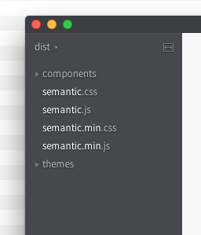

These files are mandatory to make use of the Semantic UI library. To create a new project that uses the Semantic UI library you have to place your files inside the ‘dist’ folder. 

Step 4. File>New

Step 5. File>Save> name this ‘home.html’> Save

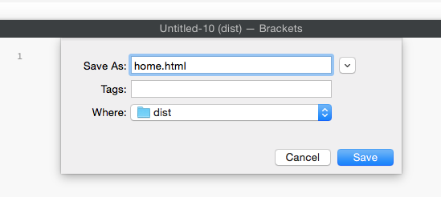

You will see the created home.html file added to the 'dist' map. 

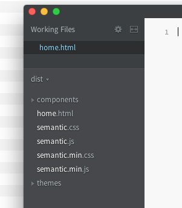

In home.html we need to include the semantic.css and semantic.js files in the header to make use of the Semantic UI library. Next to that you need to add a jQuery version link. 

Step 6. In the home.html file put the following code:


```
<html>
	<head>
		<meta charset="UTF-8">
		<title>Title of the document</title>
		<link rel="stylesheet" type="text/css" href="semantic.css"> 
		<script src="semantic.js"></script>
		<script src="http://ajax.googleapis.com/ajax/libs/jquery/1.11.1/jquery.min.js"></script>
	</head>

	<body>

	</body>

</html>
```

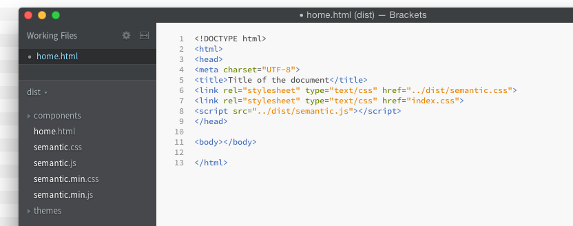


# **GREAT.. now you have everything you need to get it going!**
## Lets get starting, and build your first Semantic-UI webpage!
Now you are ready to use Semantic UI. In the next step we will guide you how to build your first landing page using the Semantic UI library.We will introduce you to the power and sheer simplicty of Semantic-UI by re-creating the **AirBnB** landing page from scratch. This is what you are going to make:

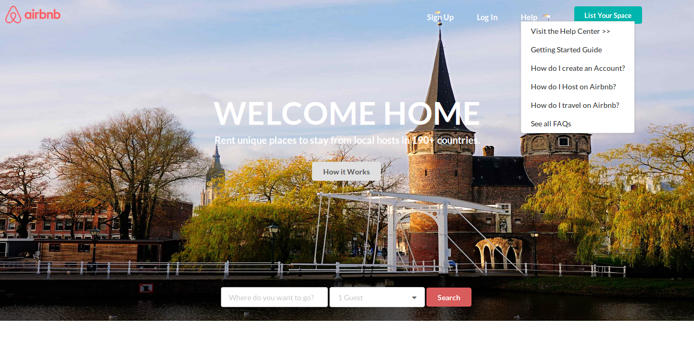

###Checklist: what do you need to use
- **Code Editor**: to code. Both the home.html & semantic.css open to edit. 
- **Browser**: to view the changes
- [The Semantic-UI menu](http://semantic-ui.com):for an overview on all the elements, collections, views, modules, behaviors & more. This to give you a complete overview of the rich library that Semantic-UI has. The library lets you look into the source code as well. 

###So where do we begin? - Layout! 
Before we dive into the cool stuff of Semantic-UI we have to set up our page's layout. The AirBnB landing page consists of two main parts, the first is the large part where everything happens (lets call it AirBig) and a smaller section which shows a small part of the next page (AirSmall). (The last is a trick to show that there is more down there!).

So to add the two main sections into your html add: 

```
<body>
	<div class="AirBig"></div>
	<div class="AirSmall"></div>
</body>
```

And we have to specify them in the semantic.css file. So go to the bottom of the semantic.css page and add: 

```
/*******************************
          Tutorial AirBnB
 *******************************/
 .AirBig{
   height: 90%;
   background-color: black;
  }

 .AirSmall{
   height: 10%;
  background-color: white;
 }
```

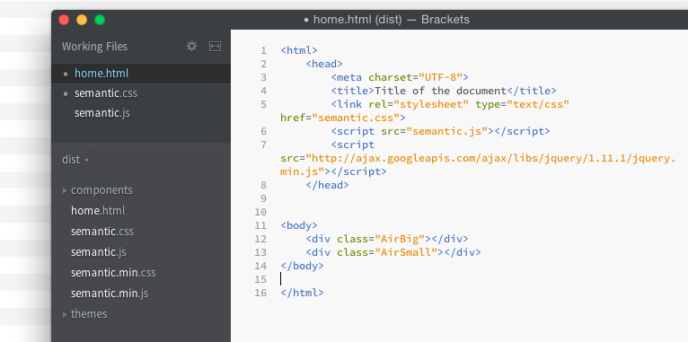

Now run the home.html file in your browser (double click the file in your folder). You will see that two sections have been created. But this doesn't look nice yet.. lets add the background picture first before we proceed. 

To add a background picture full-size add two properties to the .AirBig class and remove the background-color element in the semantic.css file:
```
.AirBig{
  height: 90%;
  background-image: url(picture location.jpg); 
  background-size: 100% 100%; 
}
```
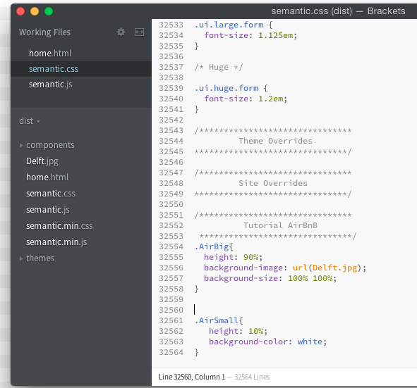


Now that's better. It already looks like the page. Great! 

### Is there more? - Yes
As you can see in the result example, you can see that the page contains of sub-sections within the .AirBig: 

1. **header**: This contains the AirBnB logo on the left and a menu with the Sign Up, Log In, Help options and the List Your Space button. 
2. **center**: This contains A big title, sub-title and a How it Works button. 
3. **footer**: which has a black background with a adjusted opacity. This section contains a search bar, a drop-up menu for the number of guests and a search button. 

To edit the page, lets add these to the home.html file. 
Within the `<div class="AirBig"></div>` add the following: 

```
<div class="AirBig">
	<div class="header"></div>
	<div class="center"></div>
	<div class="footer"></div>
</div>
```

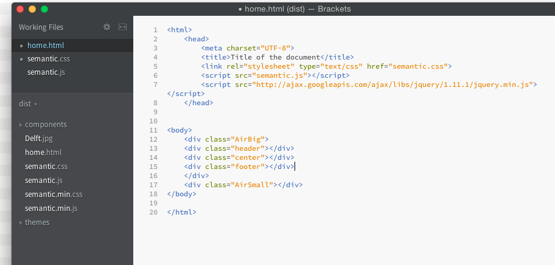


And give them the following properties in the semantic.css file: 

```
.header{
	height: 10%;
	width: 100%;
}

.center{
	height: 75%;
	width: 100%; 
}

.footer{
 	height: 15%;
	background-color: rgba(0,0,0,0.5);
	width: 100%;
}
```

You can add a background-color property to the classes and run it in the browser to see if it has worked. 

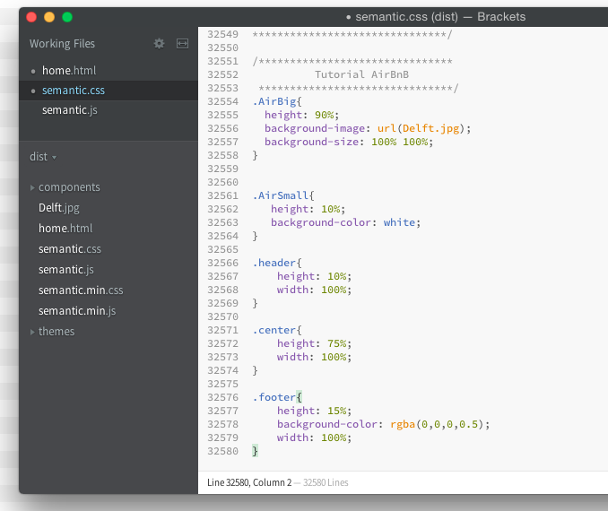

Now the general layout is complete! We now will move on to fill in the elements of the webpage in the header, center and footer.

### The header - logo, menu and a button

#### The AirBnB logo
First lets start with adding the logo in the page. Add to your home.html and within the 
`<div class="header"></div>`:

``` 
<div class="header">
 	<div class="logo">
 	
 	</div>
</div> 
```

And adjust the semantic.css file by adding the logo class and img class: 

```
 .logo{
 	height: 75;
 	padding-top: 1%;
	padding-left:1%;
	float: left; // for left alignment
 }
 img{ // this is to let the image keep its width*height ratio
	max-height: 100%;
	max-width: 100%;	
}
```

#### The menu + button 
The right side of the header consists of the Sign Up, Log In, Help and a List Your Space button elements. In order to do so we have to create a unordered list `<ul>` and line these up horizontally. For the Help and the button we are going to use our first Semantic-UI elements! The container holding the menu is named "top-menu" and the text in there is labeled "top-text".

First we are making the entire list without the Semantic-UI elements. Lets add the elements in the html by adding the following elements in your home.html, in the `<div class"header"></div>` and after the `<div class="logo"></div>`, and add "Sign Up" and "Log In":

```
<div class="header">
 	<div class="logo">
 		
 	</div>
	<!-- creates a list for the menu -->	
	<div class="top-menu">
 		<ul>
			<li id="top-text">Sign Up</li>
			<li id="top-text">Log In</li>
			<li id="top-text"></li>
			<li id="top-text"></li>
		</ul>
	</div>
</div> 
```
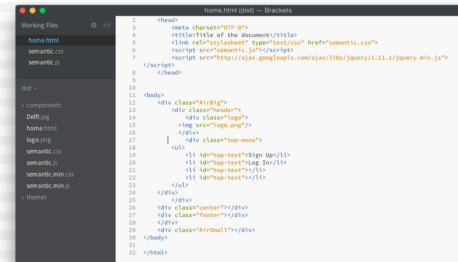

Run it in the browser.. does not look that good right? Add some styling to it first, by adjusting the semantic.css file. Add the following classes and properties:

``` 
.top-menu{
	min-width: 40%;
	height: 100%;
	float: right; //for right alignment
 }
 ul > li{
 	color: white;
 	font-size: 1em;
	margin-left: 3em;
	float: left;
	font-weight: bold;
	display: inline-block;
 }
```
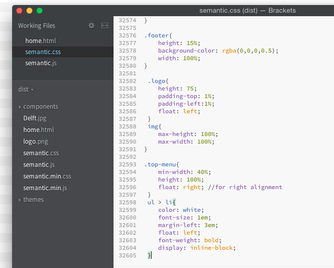


Now compare before and after these additions! We now have a horizontally aligned list. But of course we want the Help menu and the button. Here we want to add the first Semantic-UI elements. 

Please check out the semantic-ui.com Menu >> Modules >> Dropdown Here you can find all types of menus for us to readily use. The help dropdown menu on the AirBnB landing page has six different items: 
1. Visit the Help Center >> 
2. Getting Started Guide
3. How do I create an Account?
4. How do I Host on Airbnb?
5. How do I travel on Airbnb?
6. See all FAQs

From the different types depicted on the semantic-ui webpage, we will use the first one: "Dropdown - A Dropdown". This is a nice and clean dropdown menu that can show different items when clicking on it. 

#### Now lets implement the dropdown menu! 
First, on the semantic-ui website click on the view source '<>' button. This will show the code needed to generate the dropdown menu. Lets implement it into your home.html file. Between the third `<li></li>` elements add the code from the website with some small adjustments:
 
```
<div class="header">
	<div class="logo">
		
	</div>
	<!-- creates a list for the menu -->	
	<div class="top-menu">
 		<ul>
			<li id="top-text">Sign Up</li>
			<li id="top-text">Log In</li>
			<li id="top-text">
				<div class="ui dropdown">
					<div class="text">Help</div>
					<i class="dropdown icon"></i>
					<div class="menu"></div>
						<div class="item">Visit the Help Center >></div>
               			<div class="item">Getting Started Guide</div>
               			<div class="item">How do I create an Account?</div>
               			<div class="item">How do I Host on Airbnb?</div>
               			<div class="item">How do I travel on Airbnb?</div>
               			<div class="item">See all FAQs</div>
         			</div>
			</li>
			<li id="top-text"></li>
		</ul>
	</div>
</div>
```
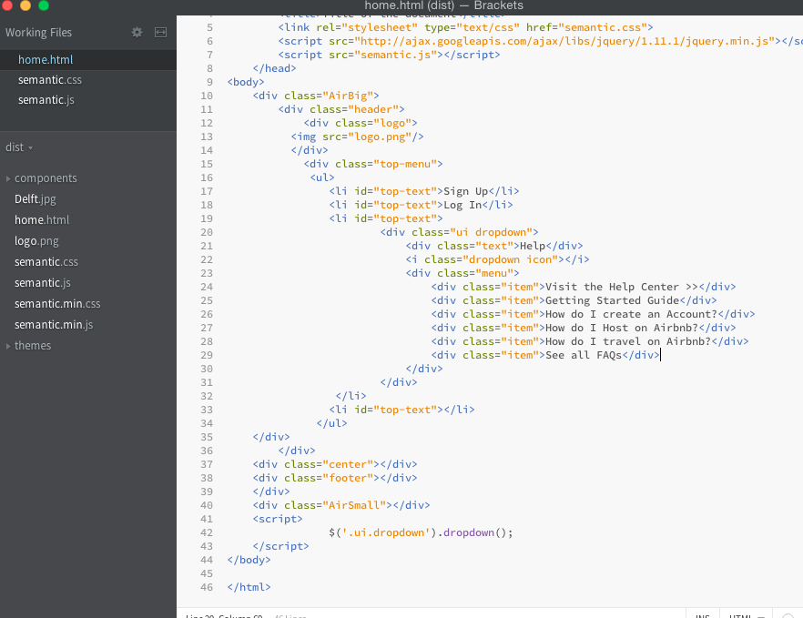

And? There is a button, but does the dropdown work? NO...? That's no surprise, the javascript needs to be initialized. 

How? In tab-menu in the dropdown module section click on the Usage tab. The first Javascript example states: `$('.ui.dropdown').dropdown();`

And this is exactly what you need to add to the home.html file. Just before your closing body tag `</body>`, add:

```
<body>
	[..the rest of the code..]
 		<script>
				$('.ui.dropdown').dropdown();
		</script>
</body>
```

Now test it again! Nice isn't it? You do not have to bother about the CSS with the semantic-ui elements. 

#### the "List Your Space" button
The button is a simple element in Semantic-UI but gives a perfect opportunity to introduce the Semantic style of coding. Here we go! 

UI definitions in Semantic are given the class name ui. This is to help tell the difference between ui elements and parts of the definition of an element. This means any element with the class name UI has a corresponding UI definition. 

So lets see how it works with the button (also check out the semantic-ui.com menu to see which buttons there are). Between the fourth (and last) menu elements `<li id="top-text"></
<li>` add the following code:

```
<li id="top-text">
 	<div class="ui button">List Your Space</div>
</li>
```

Cool! The button already looks nice. The code generated a nice grey button with darker text. But we want to change the color to that of Airbnb. So add teal in the class name and run it again: 

```
<li id="top-text">
 	<div class="ui teal button">List Your Space</div>
</li>
```

Now the button fits in the Airbnb page and looks like you want to click it. But the button seems to be a bit too large compared to the other menu elements. The default element has a medium size, so lets make it smaller: 

```
<li id="top-text">
 	<div class="small ui teal button>">List Your Space</div>
</li>
```

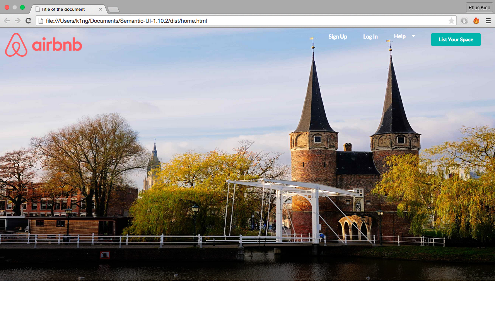

It's easy as that! Now we finished our header section. Next is the center part. 

### The Center - Big title, small title and How it Work button
The center contains of a larger title with "Welcome Home", a sub-title saying "Rent unique places to stay from local hosts in 190+ countries" and a "How it Works" button. 
To add these, both the HTML and the CSS files. 

We first have to add another container to center it all, we will give this the "center-container" class. Within the `<div class="center"></div>` add the container. Next to that add the "WELCOME HOME" text,the sub-title and a regular ui button in the container: 
```
<body>
		<div class="header"> [..header code..] </div>
		<div class="center">
				<div class="center-container">
							<b>WELCOME HOME</b>
							<br>Rent unique places to stay from local hosts in 190+ countries.</br>
							<div class="ui button" id="how-it-works">How it Works</div> // it does not need any additional classes as it is the default :) 
				</div>
		</div>
</body>
```

The semantic.css has to be adjusted as well to get to the sizes and position that we want. Add the following classes and properties to the semantic.css document: 

```
.center-container{
 		min-width: 45%;
		height: 50%;
		top: 25%;
		margin: 0 auto;
 		position: relative;
 		text-align: center; //NOTE: for Safari it is: text-align: -webkit-center;
		font-style: Helvetica;
		color: white;
		font-weight bolder;
		font-size: 1.4em;
}
 
.center-container b{
 		font-size: 3em;
 		letter-spacing: 1px;
}
 
#how-it-works{
 		margin-top: 5%;
}
```

That is all for the center section. Simple as that. We are almost there, just the footer! 

### The footer - search bar, drop-up menu and search button 
For the footer we need to add a container which holds the search bar, drop-up menu and search button, all three from the semantic-ui library.

Lets first add the container in the footer elements `<div class="footer"></div>`:

```
<body>
		<div class="header"> [..header code..] </div>
		<div class="center"> [.. center code..] </div>
		<div class="footer">
				<div class="footer-container">
				</div>
	</div>
</body>
```

For the search bar we want to use a standard input type with a placeholder text in there. From the Semantic-ui we can copy paste the code and add it to our home.html:
```
<div class="footer-container">
		<div class="ui input">
			<input placeholder="Where do you want to go?" type="text">
		</div>
</div>
```

Our second element in the footer-container div is the upward dropdown menu. This is an element when clicked will open its menu upwards. This fits as there is no space on the bottom of the page. Naturally it is called: "ui upward selection dropdown". It consists of an input name, an icon class, a default text and a menu with items. Lets implement it in the home.html code: 

```
<div class="footer-container">
		<div class="ui input">
			<input placeholder="Where do you want to go?" type="text">
		</div>
		<div class="ui upward selection dropdown">
				<input name="1 Guest" type="hidden">
				<i class="dropdown icon"></i>
				<div class="default text"> 1 Guest</div>
				<div class="menu">
						<div class="item">1 Guest</div>
						<div class="item">2 Guests</div>
						<div class="item">3 Guests</div>
						<div class="item">4 Guests</div>
						<div class="item">5 Guests</div>
				</div>
		</div>
</div>
```

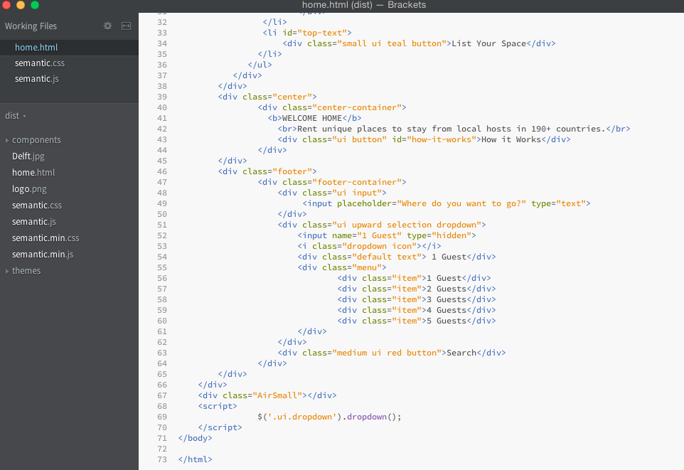

This element does not has to be initialized because this has been done earlier. The `<script>` at the bottom still needs to be there. 

Finally the last html addition is the final button. I think you can guess it at the moment what it should be! One hint: it should be a medium red button which says "Search". 

The last thing that needs to be done is adjusting the semantic.css file to fit it nicely in the page. Add the following properties to the CSS file: 

```
.footer-container{
		min-width: 45%;
		height: 50%;
		top: 30%;
		margin: 0 auto;
		position: relative;
		text-align: center;
}
```

## **Congratulations! You have created the Airbnb landing page with the elements of Semantic-UI**


